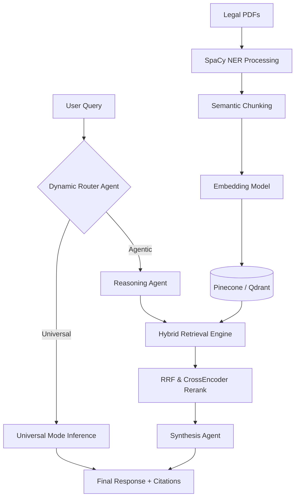
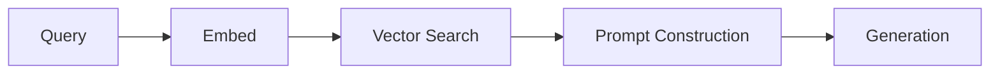
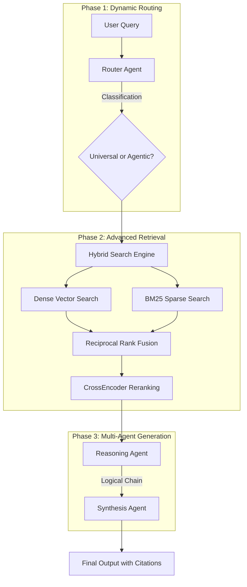

# LexVed: Detailed Project Report (DPR)

## 1. Project Objective
LexVed is an institutional-grade, multi-agent Retrieval-Augmented Generation (RAG) platform engineered specifically for complex legal document analysis. The primary objective of this project is to solve the critical challenges of hallucination, lack of context, and inefficient retrieval in standard Large Language Model (LLM) implementations within the legal domain. 

By orchestrating a highly specialized ingestion, retrieval, and generation pipeline, LexVed guarantees that all AI-generated legal insights are strictly bounded by verifiable jurisprudence, providing exact citations, reasoning transparency, and deterministic accuracy.

---

## 2. System Architecture Overview

The system operates across four primary layers:
1. **Ingestion Layer:** Processes raw legal PDFs, applies Named Entity Recognition (NER) for redaction and semantic tagging, and chunks data intelligently.
2. **Retrieval Layer:** A dual-database (Pinecone / Qdrant) hybrid retrieval engine combining Dense vector search with BM25 Sparse search, culminating in Reciprocal Rank Fusion (RRF) and CrossEncoder reranking.
3. **Multi-Agent Generation Layer:** Dynamically routes queries to optimal LLMs, generates explicit reasoning chains, and synthesizes final responses with strict anti-hallucination constraints.
4. **Presentation Layer:** A premium, glassmorphic Next.js interface providing real-time streaming, evaluation metric dashboards, and citation cards.

---

## 3. The Primitive Pipeline vs. The Enhanced Pipeline

To demonstrate the efficacy of the advanced features, LexVed maintains a standalone "Primitive Pipeline" for comparative benchmarking against the production "Enhanced Pipeline."

### 3.1 The Primitive Pipeline (Baseline)
The Primitive Pipeline represents a standard, out-of-the-box RAG implementation. 

**Workflow:**
1. A query is received.
2. The query is embedded using a single, static embedding model.
3. A simple K-Nearest Neighbors (KNN) search is performed against a local vector database.
4. The retrieved text is passed directly into a zero-shot prompt.
5. The LLM generates a response in a single pass.

**Limitations of the Primitive Pipeline:**
* **Hallucinations:** Without explicit reasoning steps, the LLM often conflates its pre-trained knowledge with the retrieved context.
* **Retrieval Blindspots:** Relying solely on dense embeddings misses exact-keyword matches (e.g., specific statute numbers or docket IDs).
* **Latency Bottlenecks:** Routing all queries, regardless of complexity, to a massive LLM results in unnecessary computational overhead.

### 3.2 The Enhanced Pipeline (Production)
The Enhanced Pipeline addresses every limitation of the Primitive Pipeline through a multi-tiered, agentic approach.

---

## 4. Key Features of the Enhanced Pipeline

### A. Dual Operational Framework
LexVed divides its execution paths into two distinct, high-fidelity approaches based on user selection:
1. **Standard Mode (Universal RAG):** Orchestrates dynamic LLM complexity routing. Simple queries are handled by lightweight, rapid-inference engines, while analytical tasks scale up to heavyweight synthesis models.
2. **Agent Mode (Stateful LangGraph):** Moves beyond linear execution to run an autonomous single-agent cognitive loop. The agent evaluates the query and calls on-demand tools in a stateful, iterative logic chain.

### B. Dynamic Model Orchestration
LexVed utilizes a sophisticated model routing and orchestration strategy to balance speed, depth, and efficiency:
* **Standard (Dynamic Routing):** Automatically classifies the user's query complexity using a dedicated router agent, checks for local cluster warm-up status, and synthesizes answers using the target model stream.
* **Agent (LangGraph Engine):** Employs high-parameter models like `llama-3.3-70b-versatile` inside the state machine to reason cleanly about when to retrieve documents, parse entities, extract provisions, or de-identify context.
* **Infrastructure Parity:** Supports cross-infrastructure benchmarking across four distinct embedding models (MiniLM, MPNet, DistilBERT, and BGE-M3) on both Pinecone and Qdrant.

### C. Hybrid Retrieval and Reranking
Dense vector search excels at understanding semantic intent, while sparse search (BM25) excels at exact keyword matching. LexVed executes both simultaneously, merges the results using Reciprocal Rank Fusion (RRF), and then passes the fused list through a CrossEncoder to re-score the chunks based on deep contextual relevance, guaranteeing that the most accurate legal precedent is fed to the LLM.

### D. Hierarchical Sub-Indexing
During ingestion, documents are categorically tagged (e.g., Civil, Criminal, Constitutional). At query time, the system can selectively filter the vector database, preventing context contamination across distinct legal domains.

### E. Data Integrity & SHA-256 Fingerprinting
To maintain a production-grade corpus, LexVed implements a cryptographic fingerprinting system. Every legal document is hashed using SHA-256 before ingestion. This allows the platform to instantly skip duplicate files, detect content modifications in existing files, and maintain a 1:1 relationship between physical documents and vector segments.

### F. Secure PDF Deep-Linking
The citation engine has been upgraded from static text to interactive "Smart Citations." By utilizing secure one-time URL tokens and browser-native fragment identifiers (`#page=X`), LexVed allows legal researchers to jump directly from an AI-generated answer to the exact page of the cited document in a dedicated viewer.

### G. GPU Cluster Transparency
For local deployments (Ollama), LexVed monitors the VRAM state of the GPU. If a model cold-start is detected, the UI provides transparent feedback ("Loading neural weights..."), ensuring a seamless user experience during model initialization.

### G. Agentic Hardening & Context Continuity
In the latest version, LexVed has been hardened for institutional audit readiness with three key memory and persona features:
* **Intelligent Query Condensation:** A specialized "Condensation Engine" rephrases multi-turn follow-up questions into standalone, context-aware queries. This prevents the "Context Drift" typical in RAG systems when users ask vague questions like "tell me more."
* **Strict Topic Locking:** The Reasoning Agent is now strictly constrained to the subject matter established in the conversation history, preventing name-collision hallucinations (e.g., confusing two different cases with the same first name).
* **Persona Refinement:** The "Synthesis Counsel" has been stripped of generic AI placeholders and formal letter templates, providing a more natural, human-expert-like interaction.

---

## 5. Development Timeline & Session Logs

### Session: Institutional RAG Pipeline Hardening (May 14, 2026)
* **Vector DB Restoration:** Successfully re-connected the production "Hybrid Index" (19,483 vectors) after identifying it as the gold-standard repository.
* **UI/UX Premium Polish:** Implemented automatic scrolling for streaming and premium glassmorphic scrollbars for reasoning chains.
* **Authentication Sync:** Synchronized JWT display names to enable personalized AI greetings ("Counsel Arjun").
* **Ingestion Integrity:** Patched the PDF processing pipeline to extract and persist physical page numbers across both Pinecone and Qdrant.

### Session: Stability Hardening & Deep Linking (May 15, 2026)
* **SHA-256 Fingerprinting:** Implemented cryptographic hashing for document duplicate prevention.
* **Deep Citation Linking:** Refactored the backend and frontend to support secure, page-level PDF jumping.
* **GPU Awareness:** Integrated real-time Ollama process monitoring for cold-start UI feedback.
* **Infinite Model Wheel:** Refactored the Intelligence Engine UI for shortest-path 3D rotation and forced-direction navigation.

### Session: Transition to Stateful Agentic AI (May 22, 2026) [NEW]
* **LangGraph Integration:** Replaced the legacy fixed reasoning/synthesis pipeline with a state-managed LangGraph single agent framework.
* **Declarative State & Memory:** Established `AgentState` schema using TypedDict and `add_messages` reducer to accumulate chat and tool outputs across iterative reasoning cycles.
* **Fidelity Tool Registries:** Created tool wrappers for core functions: `retrieve_documents` (triggers RRF + BM25 + Dense + CrossEncoder), `extract_citations`, `extract_entities` (SpaCy NER), and `deidentify_text` (PII Scrubbing).
* **Config Manager Refactor:** Decoupled frontend selections by dynamically fetching model configurations and metadata tags from `/api/settings/config`.

### Session: Generation Efficiency Metrics Integration (June 5, 2026) [NEW]
* **Prefill Latency (M25):** Captured the exact hardware prefill/prompt processing latency (`prompt_time`) using Hugging Face completions/local performance timers.
* **Time To First Token / TTFT (M26):** Implemented streaming response measurement in both the Enhanced and Primitive evaluation engines, computing the exact delta from API request initiation to the receipt of the first text token.
* **Unified Audit Dashboard:** Expanded the single-model audit, comparative audit, CSV exports, and PDF reports to display and analyze these two new efficiency metrics side-by-side.

### Session: Swarm Intelligence & GPU-Accelerated Auditing (June 9, 2026) [NEW]
* **Phase 3 (Workflow Automation):** Configured deterministic Case Brief DAG pipelines where search, citation extraction, drafting, and PII sanitization run in a fixed sequence.
* **Phase 4 (Collaborative Swarm):** Implemented a LangGraph state machine consisting of specialized agents: Researcher, Drafting Counsel, PII Redactor, and a loop-back Compliance Auditor criticizing and revising draft briefs.
* **M27 (Generation Throughput):** Integrated throughput measurement (tokens/sec) calculations inside the streaming pipelines.
* **Pinecone Comparative Benchmark:** Created `backend/pinecone_comparative_benchmark.py` utilizing Pinecone index and local BM25 to run side-by-side RAG pipeline evaluations, generating printable landscape PDF audit sheets.

### Session: Research-Grade Metrics & Pluggable Frameworks (June 9, 2026 - Part 2) [NEW]
* **100-Query Synthetic Dataset:** Replaced the manually defined 10 queries with a programmatically generated, 100-query synthetic dataset (`data/synthetic_evaluation_dataset.json`). Each item maps a legal query and ground-truth answer to a known target document chunk, enabling true non-circular evaluation.
* **Standard IR Benchmarks (M28-M31):** Integrated standard Information Retrieval benchmarks into the metric suite: Recall@10, Mean Reciprocal Rank (MRR), nDCG@10, and Precision@5.
* **Enhanced Metric Reliability:** Integrated PorterStemmer for token cleaning in Ground Truth Coverage (M15), and expanded the statutory/case-law citation regex (M20) to capture NI Act, section codes, articles, and case reporters objectively.
* **Pluggable Evaluation Adapters:** Created `backend/src/evaluation/framework_evaluators.py` offering pluggable integrations for RAGAS and DeepEval frameworks, complete with standardized dataset exporting.

