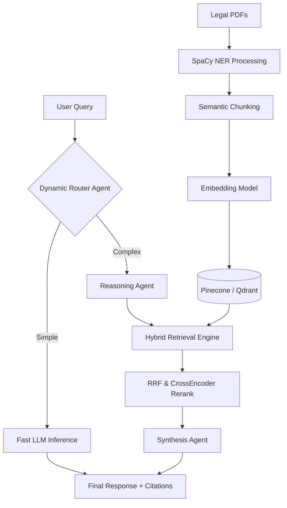
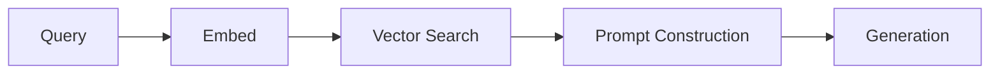
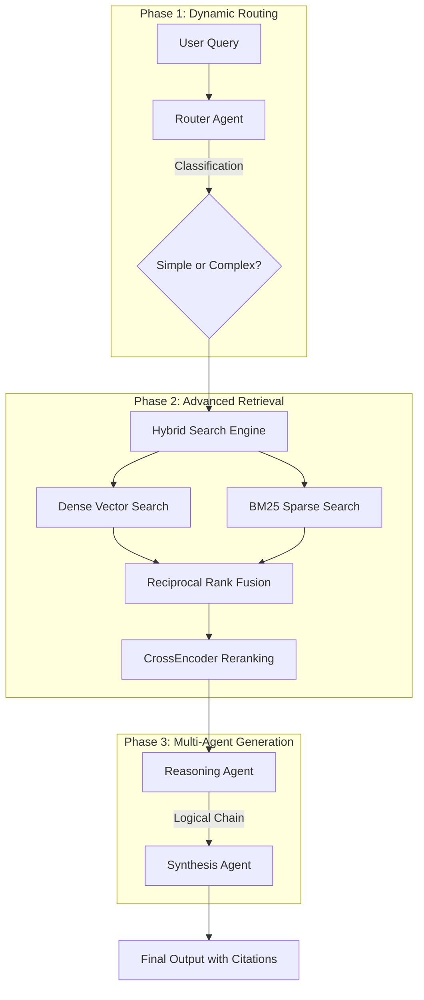

# LexVed: Detailed Project Report (DPR)

## 1. Project Objective
LexVed is an institutional-grade, multi-agent Retrieval-Augmented Generation (RAG) platform engineered specifically for complex legal document analysis. The primary objective of this project is to solve the critical challenges of hallucination, lack of context, and inefficient retrieval in standard Large Language Model (LLM) implementations within the legal domain. 

By orchestrating a highly specialized ingestion, retrieval, and generation pipeline, LexVed guarantees that all AI-generated legal insights are strictly bounded by verifiable jurisprudence, providing exact citations, reasoning transparency, and deterministic accuracy.

---

## 2. System Architecture Overview

The system operates across four primary layers:
1. **Ingestion Layer:** Processes raw legal PDFs, applies Named Entity Recognition (NER) for redaction and semantic tagging, and chunks data intelligently.
2. **Retrieval Layer:** A dual-database (Pinecone / Qdrant) hybrid retrieval engine combining Dense vector search with BM25 Sparse search, culminating in Reciprocal Rank Fusion (RRF) and CrossEncoder reranking.
3. **Multi-Agent Generation Layer:** Dynamically routes queries to optimal LLMs, generates explicit reasoning chains, and synthesizes final responses with strict anti-hallucination constraints.
4. **Presentation Layer:** A premium, glassmorphic Next.js interface providing real-time streaming, evaluation metric dashboards, and citation cards.

---

## 3. The Primitive Pipeline vs. The Enhanced Pipeline

To demonstrate the efficacy of the advanced features, LexVed maintains a standalone "Primitive Pipeline" for comparative benchmarking against the production "Enhanced Pipeline."

### 3.1 The Primitive Pipeline (Baseline)
The Primitive Pipeline represents a standard, out-of-the-box RAG implementation. 

**Workflow:**
1. A query is received.
2. The query is embedded using a single, static embedding model.
3. A simple K-Nearest Neighbors (KNN) search is performed against a local vector database.
4. The retrieved text is passed directly into a zero-shot prompt.
5. The LLM generates a response in a single pass.

**Limitations of the Primitive Pipeline:**
* **Hallucinations:** Without explicit reasoning steps, the LLM often conflates its pre-trained knowledge with the retrieved context.
* **Retrieval Blindspots:** Relying solely on dense embeddings misses exact-keyword matches (e.g., specific statute numbers or docket IDs).
* **Latency Bottlenecks:** Routing all queries, regardless of complexity, to a massive LLM results in unnecessary computational overhead.

### 3.2 The Enhanced Pipeline (Production)
The Enhanced Pipeline addresses every limitation of the Primitive Pipeline through a multi-tiered, agentic approach.

---

## 4. Key Features of the Enhanced Pipeline

### A. Multi-Agent Architecture
Instead of generating an answer in a single pass, the Enhanced Pipeline splits the cognitive load across three specialized agents:
1. **Routing Agent:** Instantly evaluates the complexity of the user's query.
2. **Reasoning Agent:** Mandated to read the retrieved context and "think aloud." It drafts a step-by-step logical chain, actively searching for contradictions, precedents, and facts. It is strictly constrained from utilizing outside knowledge.
3. **Synthesis Agent:** Acts as the Senior Legal Counsel. It takes the raw logical chain from the Reasoning Agent and drafts a cohesive, professional, and authoritative final response, embedding exact citations.

### B. Dynamic Model Routing
To optimize both speed and intelligence, LexVed utilizes a multi-model orchestration strategy:
* **Simple Queries:** Routed to `llama-3.1-8b-instant` via Groq for ultra-fast, low-latency inference.
* **Complex Queries:** Escalated to `llama-3.3-70b-versatile` for deep, multi-faceted analytical reasoning.

### C. Hybrid Retrieval and Reranking
Dense vector search excels at understanding semantic intent, while sparse search (BM25) excels at exact keyword matching. LexVed executes both simultaneously, merges the results using Reciprocal Rank Fusion (RRF), and then passes the fused list through a CrossEncoder to re-score the chunks based on deep contextual relevance, guaranteeing that the most accurate legal precedent is fed to the LLM.

### D. Hierarchical Sub-Indexing
During ingestion, documents are categorically tagged (e.g., Civil, Criminal, Constitutional). At query time, the system can selectively filter the vector database, preventing context contamination across distinct legal domains.

### E. Evaluation Fingerprinting and Caching
The platform features an automated 24-KPI benchmark suite. To preserve computational resources, LexVed fingerprints the dataset corpus. If an evaluation is triggered without any new PDFs having been ingested, the system bypasses the redundant LLM execution and instantly serves the cached benchmark results.

### F. Strict Anti-Hallucination Protocols
If the retrieval engine returns zero results, or if the retrieved results do not contain the answer, the Reasoning Agent is explicitly instructed to halt. The Synthesis Agent will then inform the user that the institutional repository lacks the required information, completely neutralizing the risk of the LLM inventing fabricated case law.
