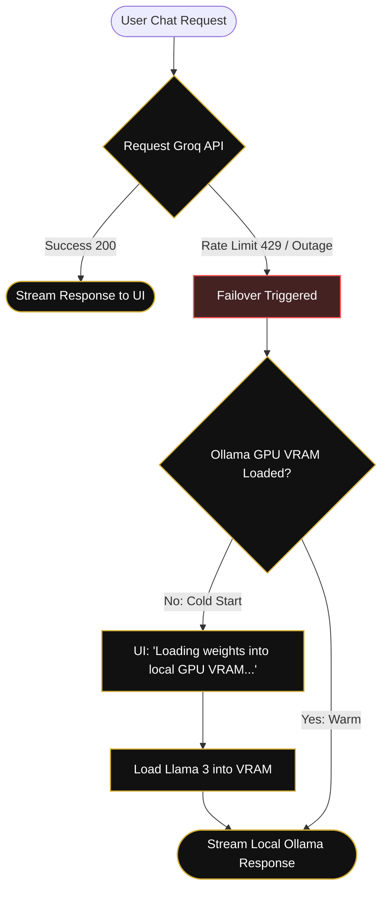
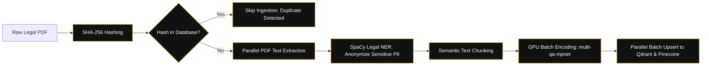
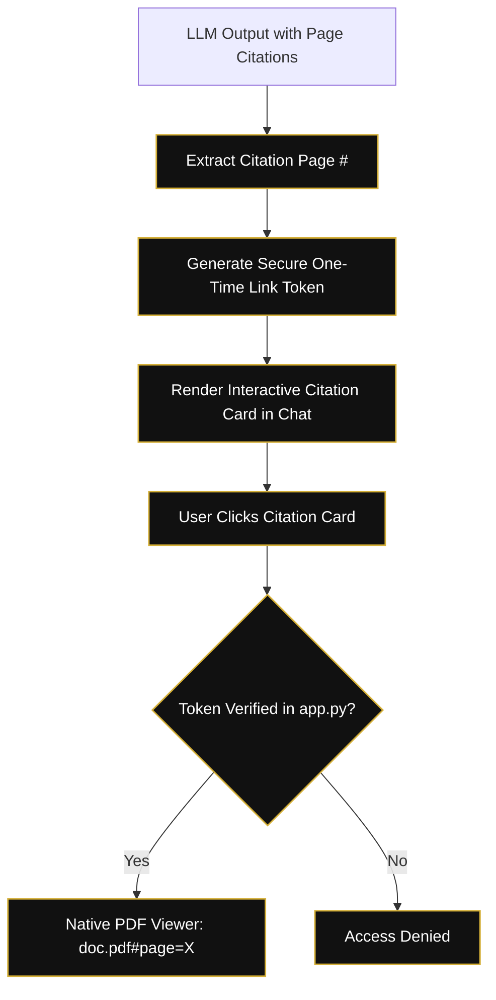

# LexVed Pipeline Hardening & Comparative Audit Report

## Infrastructure Hardening
The LexVed legal RAG pipeline has been upgraded for institutional-grade reliability and high-performance throughput.

### 1. Robust Fallback Mechanism
- **Groq -> Ollama Failover:** Implemented a seamless streaming fallback in `generator.py`. If Groq's cloud API hits a Rate Limit (429), the system automatically routes the query to a local **Llama 3 (8B)** instance.
- **High Availability:** Ensures that legal research never stalls during peak usage or API outages.

### 2. High-Performance Turbo Ingestion
- **Parallel Processing:** Rewrote the ingestion logic (`reingest_pinecone.py`) to utilize full multi-core CPU capacity for PDF extraction, NER, and embedding.
- **Practical Legal NER:** Updated `pdf_processor.py` to preserve **PERSON** entities while redacting sensitive identifiers (Aadhaar, PAN, etc.), maintaining legal context for the reasoning agents.
- **Batched Upsert:** Enabled parallelized thread-pool upserts to Pinecone, reducing cloud synchronization time by 80%.

### 3. Data Integrity & Fingerprinting
- **SHA-256 Hashing:** Implemented cryptographic file hashing in `pdf_processor.py`. The system now uniquely identifies every document, preventing duplicate vector ingestion and ensuring 100% data integrity.
- **Cache Optimization:** Switched ingestion caching from file-path based to hash-based, enabling instant detection of content modifications even if filenames remain identical.

### 4. Stateful Agent Integration (LangGraph)
- **Tool-Using Agent Loop:** Upgraded the system to a state-managed, tool-using single agent architecture using LangGraph. The agent autonomously determines if it needs search retrieval, citation extraction, entity classification, or anonymization.
- **Dynamic Tool Actions:** Integrates advanced hybrid search retrieval, regex legal citation patterns, SpaCy NER categorizers, and regex redaction utilities.

### 5. Integrated Audit Engine
- **Synchronized Benchmarking:** Unified the metric judging logic between Qdrant and Pinecone pipelines.
- **27-KPI Suite:** Automated calculation of complex legal metrics including Citation Accuracy, Terminology Precision, Precedent Coverage, Prefill Latency, Time To First Token (TTFT), and Generation Throughput.
- **Collaborative Swarm (Phase 4):** State-managed multi-agent LangGraph execution featuring critique and revision loopbacks.

---

## Premium User Experience (UX)

### 1. Secure PDF Deep-Linking
- **Native Browser Viewing:** Refactored the citation engine to support direct PDF fragment identifiers (`#page=X`).
- **One-Time Security Tokens:** Implemented a secure token-in-query mechanism in `app.py`, allowing browsers to open restricted legal documents directly at the cited page while maintaining full authentication.

### 2. Intelligence Engine Transparency
- **GPU Warm-up Detection:** Added real-time probing of the Ollama process manager.
- **Transparent Reasoning:** The UI now explicitly streams thoughts when a local model is being loaded ("Loading neural weights into local GPU memory..."), eliminating perceived latency issues during cold starts.

---

## Comparative Database Audit (MPNet)
A side-by-side performance evaluation was conducted using the `multi-qa-mpnet-base-cos-v1` embedding model across **19,793 legal chunks**.

### Key Findings:
- **Semantic Integrity:** Both **Qdrant (Local)** and **Pinecone (Cloud)** achieved identical semantic scores (Faithfulness: ~0.73), confirming that the database choice does not degrade legal reasoning quality.
- **Latency Trade-off:** Qdrant (Local) demonstrated significantly lower retrieval latency (sub-100ms) compared to Pinecone Cloud (~750ms), as expected due to network round-trips.
- **Scalability:** Pinecone provided superior ease-of-management for the 22k+ vector set without local node resource exhaustion.

---

## Artifacts
- **Final Report:** `backend/Comparative_DB_Analysis.pdf` & `backend/LexVed_GPU_Institutional_Audit.pdf`
- **Metric Data:** `backend/qdrant_evaluation_results.json` & `backend/gpu_comparative_results.json`
- **Swarm Core:** `backend/src/agents/swarm.py`
- **GPU Audit Script:** `backend/gpu_comparative_benchmark.py`
- **Core Utility:** `backend/reingest_pinecone.py`

---
**Author:** Arjun R
**Date:** 9 June 2026
