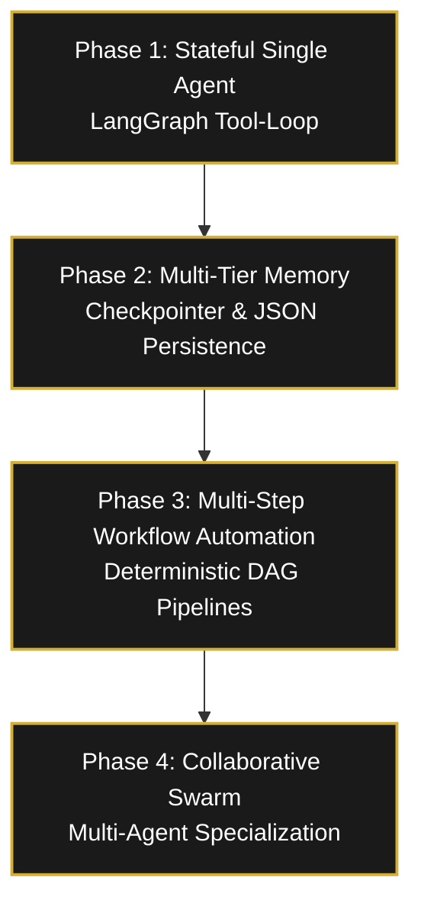
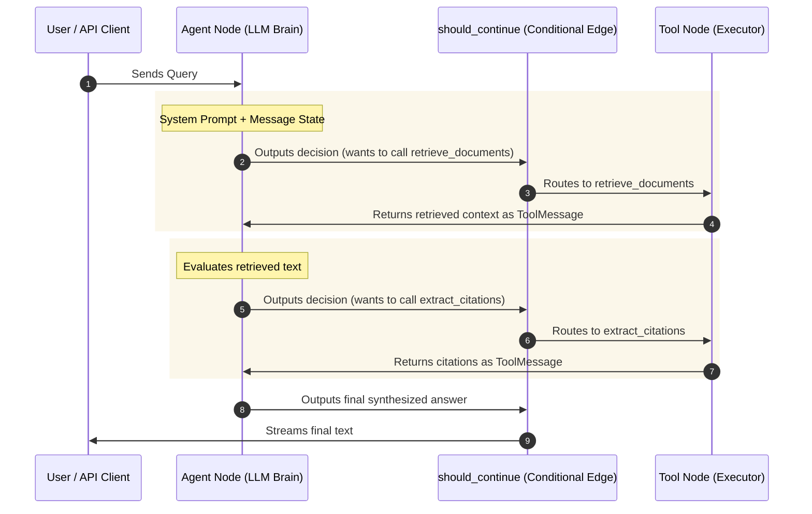
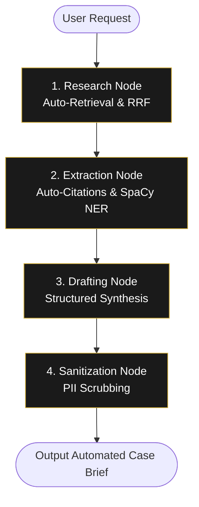
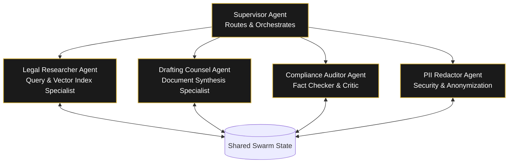

# LexVed Architectural Evolution & Multi-Phase Agentic Roadmap

This report details the architectural phases of the **LexVed Legal Intelligence Platform**, tracking its evolution from a static Retrieval-Augmented Generation (RAG) pipeline to an autonomous, multi-agent collaborative swarm. 

---

## Detailed Overview of the Development Phases

The transition of LexVed is structured into four distinct phases to solve the critical challenges of legal RAG: context drift, reasoning hallucinations, lack of structured workflow execution, and LLM tool dilution.



---

## Phase 1: Conversion to Stateful, Tool-Based Agent (LangGraph)

### 1. The Architectural Shift
In standard RAG, the execution flow is entirely linear and hardcoded:
$$\text{User Query} \rightarrow \text{Retrieve Documents} \rightarrow \text{Rerank} \rightarrow \text{Synthesize Answer}$$

While this works for simple lookups, it fails for complex legal tasks. For example, if a user asks: *"Check if the petitioner in the Balbir Kaur case is mentioned in any other tax evasion ruling, and redact their name in the final answer."* A linear pipeline cannot handle this because it requires:
1. Finding the primary case.
2. Extracting the petitioner's name.
3. Formulating a *new* search query for that petitioner.
4. Performing a second retrieval.
5. Running named entity recognition to redact the name.
6. Synthesizing the final answer.

### 2. LangGraph's Cyclic State Machine
By implementing **LangGraph**, LexVed converted this linear flow into a **cyclic state machine** (defined in [graph.py](file:///home/arjun/Desktop/LexVed/backend/src/agents/graph.py)):

- **Shared Graph State:** The system defines a shared `AgentState` containing the conversation history. Every node reads from this state, performs its task, and returns updates that are merged back.
- **The Agent Loop:** The LLM acts as the router. It receives the conversation state and decides whether to output a text response or request a tool.
- **Tool Execution:** If the LLM requests a tool (e.g., `retrieve_documents` or `extract_citations`), the graph routes execution to the `ToolNode`. The tool runs, appends its result back to the `AgentState` as a `ToolMessage`, and loops back to the agent node. The agent then evaluates the tool output and decides its next move.



### 3. Before vs. After Comparison (With Example)
* **Before (Linear Pipeline):** The search logic was hardcoded and could not adapt or branch.
  - *Example:* If you asked *"Who was the petitioner in the Balbir Kaur case, and is there any other case that mentions them?"*, a linear RAG system performed a single search for "Balbir Kaur", extracted the petitioner's name, but could not search again for other cases containing that name.
* **After (Stateful Agent Loop):** A cyclic state machine where the LLM can call tools, inspect results, and decide to run more tools.
  - *Example:* The agent retrieves the Balbir Kaur case, identifies the petitioner's name, writes a *new* search query (*"Balbir Kaur case law"*), calls the retriever a second time, and compiles all findings into a single answer.

---

## Phase 2: Adding Multi-Tier Memory Systems

Memory in legal RAG must operate on two distinct levels: short-term conversation tracking (within a single thread) and long-term preference alignment (across multiple days and sessions).

```
 ┌─────────────────────────────────────────────────────────────────────────┐
 │                            LexVed Memory                                │
 └────────────────────────────────────┬────────────────────────────────────┘
                                      │
           ┌──────────────────────────┴──────────────────────────┐
           ▼                                                     ▼
┌───────────────────────────────────────┐             ┌───────────────────────────────────────┐
│     Short-Term Memory (Ephemeral)     │             │     Long-Term Memory (Persistent)     │
├───────────────────────────────────────┤             ├───────────────────────────────────────┤
│ - Thread checkpoints via MemorySaver  │             │ - JSON-based file storage             │
│ - Retains immediate chat turns        │             │ - Tracks user facts & preferences     │
│ - Enables multi-turn context locks    │             │ - Persists across sessions/logouts   │
└───────────────────────────────────────┘             └───────────────────────────────────────┘
```

### 1. Ephemeral Conversation Memory (Short-Term)
We integrated LangGraph’s `MemorySaver` checkpointer. 
- **How it works:** After every step in the agent graph, a snapshot of the `AgentState` is saved to memory.
- **Thread Isolation:** Snaps are keyed by a unique `thread_id`. When a request is sent with the same `thread_id`, the checkpointer pre-loads the state history before calling the agent node. This enables the agent to remember context lock boundaries (e.g., keeping track of a case's specific facts without letting follow-up questions drift to other cases in the vector store).

### 2. Structured Profile Memory (Long-Term)
Managed by [memory_manager.py](file:///home/arjun/Desktop/LexVed/backend/src/agents/memory_manager.py):
- **Cross-Session Persistence:** When a user logs in, their preferences (e.g. *"prefer detailed statutory analysis"*) or case metadata (*"client's primary counsel is Adv. Sen"*) are stored in `data/long_term_memory.json` under their username.
- **Context Security:** Uses a thread-safe `contextvars.ContextVar` to keep the active username isolated during concurrent API operations.
- **Self-Updating Memory Tools:** The agent is equipped with:
  - `remember_legal_fact(fact_key, fact_value)`: Writes preferences directly to the profile.
  - `recall_legal_facts()`: Restores profile facts on agent startup, allowing the model to adapt its style and tone deterministically.

### 3. Before vs. After Comparison (With Example)
* **Before (Stateless API):** The agent forgot all context as soon as the API call ended.
  - *Example:* If you asked the agent to *"Remember that my client is Balbir Kaur"* and then followed up in a new session with *"What is our legal argument?"*, the agent would respond with *"I don't know who your client is, please provide details."*
* **After (Multi-Tier Memory):** Ephemeral conversation context is locked to thread IDs, and long-term facts/preferences are saved in `long_term_memory.json`.
  - *Example:* The agent saves the client's name to the user profile. In a new session weeks later, it automatically reads the profile and drafts the application specifically for Balbir Kaur.

---

## Phase 3: Multi-Step Workflow Automation

### 1. The Rationale
In Phase 1, the agent determines the tool execution sequence. However, for structured legal processes, relying on the LLM's step-by-step reasoning can introduce instability:
- The LLM might skip citation validation during a rush.
- It might retrieve information but fail to redact client names due to instruction-following limits.
- The execution latency is high because the LLM must pause and think before each tool invocation.

**Phase 3 (Workflow Automation)** solves this by using LangGraph to build **deterministic, automated DAGs (Directed Acyclic Graphs)**. For workflows like *Drafting a Case Brief* or *Conducting a Compliance Audit*, the sequence of steps is hardcoded in the graph layout, while the LLM is used strictly inside the nodes to perform synthesis.

### 2. The Case Brief Generator Workflow (Example)
We define a specialized workflow where the user specifies a case name or topic, and the system executes a sequence of nodes automatically:



- **Workflow State:** Extends `AgentState` with dedicated schema keys:
  ```python
  class WorkflowState(TypedDict):
      query: str
      raw_documents: list
      citations: list
      entities: list
      draft_brief: str
      final_brief: str
  ```
- **Execution Nodes:**
  1. **`research_node`:** Automatically queries the hybrid database (Qdrant/Pinecone) using the user's query.
  2. **`extraction_node`:** Automatically parses the retrieved documents for legal citations and extracts party names.
  3. **`draft_node`:** Invokes `llama-3.3-70b-versatile` with the extracted documents, citations, and entities to write the brief using a strict structural template (Facts, Procedural History, Legal Issues, Holdings, Rationale).
  4. **`sanitization_node`:** Feeds the drafted brief into the PII redaction pipeline to sanitize private data before returning it to the user.

### 3. Before vs. After Comparison (With Example)
* **Before (Purely Agentic Selection):** The agent decided dynamically which tool to run at each step, making complex workflows prone to omissions.
  - *Example:* When compiling a brief, the LLM might get lazy and write the summary directly from memory, skip checking citations altogether, or forget to redact party names, leaking private client details.
* **After (Workflow Automation DAG):** The sequence of steps (`Research` $\rightarrow$ `Extract` $\rightarrow$ `Draft` $\rightarrow$ `Sanitize`) is hardcoded as a LangGraph workflow.
  - *Example:* When you run `/brief Balbir Kaur`, the system programmatically pulls the case files, extracts citations/entities locally, runs the LLM *once* to draft the structured sections, and automatically scrubs PII.

---

## Phase 4: Collaborative Multi-Agent Architecture (Swarm)

As LexVed scales to support advanced legal tasks, a single agent with a massive toolset suffers from **tool dilution** (the model gets confused by too many choices) and **context bloat** (mixing raw search results with citation databases in a single prompt).

Phase 4 solves this by transitioning to a **cooperative swarm** of specialized agents.



### The Swarm Members
1. **Legal Researcher Agent:**
   - *Tools:* `retrieve_documents`, query expansion.
   - *Role:* Focuses entirely on finding relevant context. It parses spelling variations, expands acronyms, evaluates ranking results, and filters irrelevant segments.
2. **Drafting Counsel Agent:**
   - *Tools:* Memory recall, legal database reference sheets.
   - *Role:* Specialized in drafting professional, executive summaries and legal briefs with authoritative tone and structure.
3. **Compliance Auditor Agent (The Critic):**
   - *Tools:* Verification checkers.
   - *Role:* Compares the draft generated by the Drafting Counsel against the raw documents retrieved by the Researcher. It flags any factual inconsistencies, unsupported claims, or missing page numbers, returning the draft back to the Writer if discrepancies are found.
4. **PII Redactor Agent:**
   - *Tools:* Named Entity Recognition, custom regex rules.
   - *Role:* Acts as the security gatekeeper. It sanitizes the completed, audited draft to scrub private info.

### Why LangGraph is Ideal for Phase 4
LangGraph handles multi-agent orchestration seamlessly by:
- Defining each agent as a separate graph node.
- Routing messages dynamically using a **Supervisor Node** or a choreographed state-passing loop.
- Isolating tool lists so each agent only sees tools relevant to its specific domain, drastically increasing reasoning accuracy.

### 3. Before vs. After Comparison (With Example)
* **Before (Single Agent with 6+ Tools):** A single LLM acted as the researcher, writer, critic, and redactor, overloading its context window and reasoning capability.
  - *Example:* A single model reads a 50-page tax filing document, tries to retrieve relevant precedents, check statutory codes, draft the audit report, and audit its own citations simultaneously, leading to high rate of hallucinations.
* **After (Cooperative Agent Swarm):** Cognitive tasks are split among dedicated agents who critique and pass data to each other.
  - *Example:* The **Researcher** retrieves context, the **Writer** drafts the report, the **Compliance Auditor** critiques the draft line-by-line against the source documents to catch citation errors, and the **Redactor** scrubs PII.

---

> [!NOTE]
> All code changes, including the stateful graph implementations in Phase 1 and the thread-safe context memory managers in Phase 2, are successfully deployed and verified under `/backend/src/agents/`.
