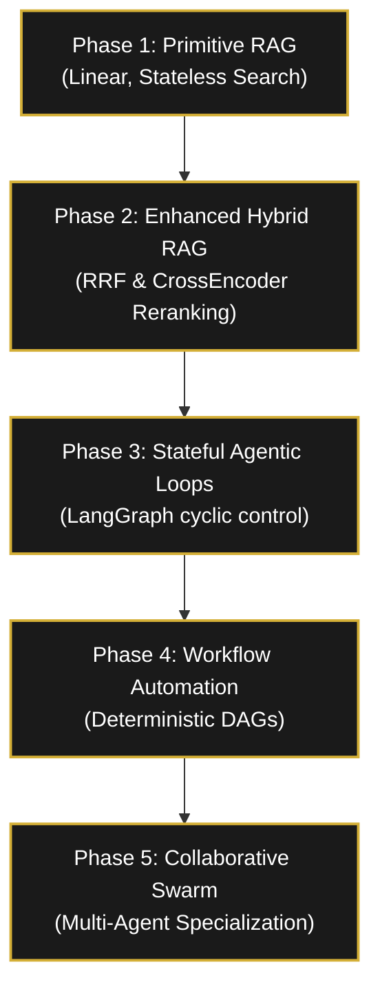
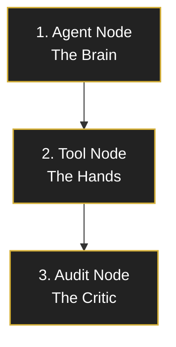
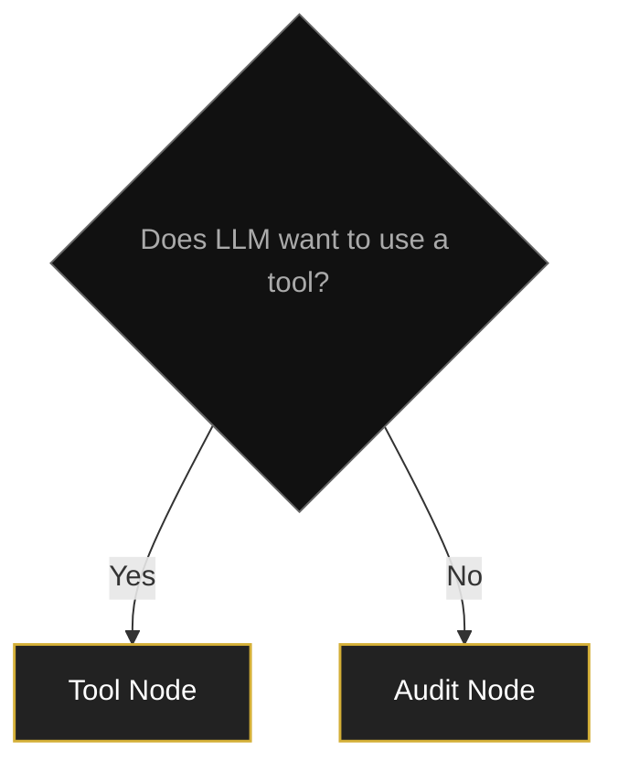
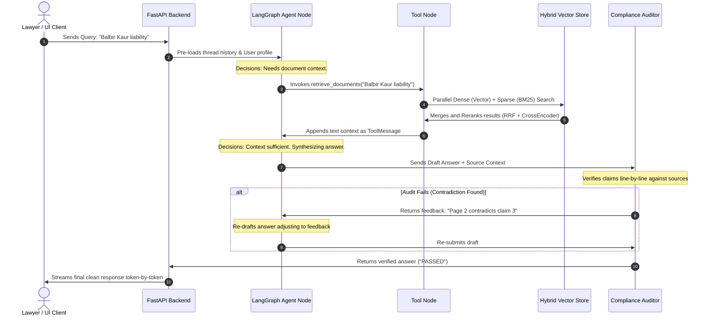
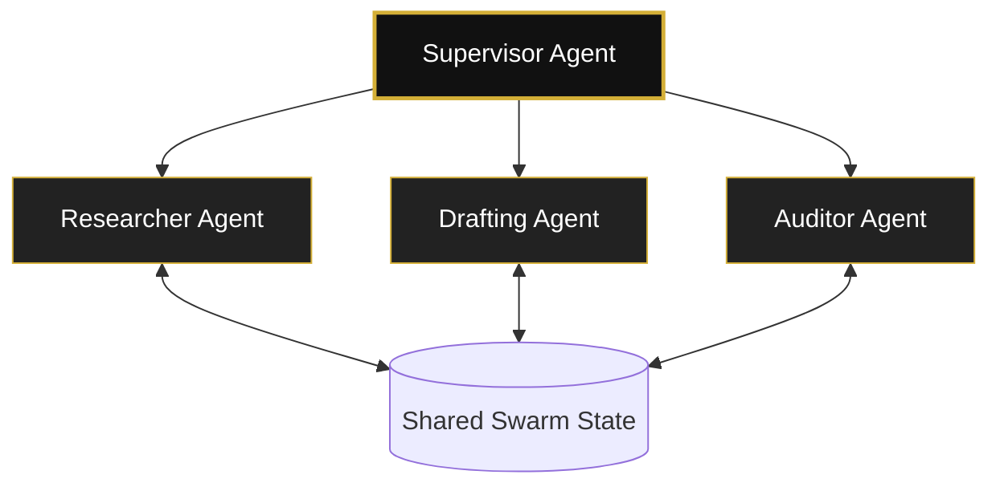

# LexVed Legal RAG: Architecture & Handover Presentation

This guide is structured as a slide-by-slide pedagogical presentation for evaluators, technical interviewers, and design reviews. It progresses logically from fundamental concepts and limitations to architectural diagrams, code implementations, and performance metrics.

---

# The Core Challenge of Legal RAG

### Why Traditional RAG Fails in Legal Environments
Legal document analysis has zero tolerance for errors. Traditional Retrieval-Augmented Generation (RAG) models suffer from:
1. **Context Drift**: Raw search results mix with irrelevant text, diluting the LLM's attention.
2. **Citation Hallucinations**: LLMs fabricate section numbers or invent non-existent precedents.
3. **Factual Inconsistency**: Generated answers contain claims that are not backed by the retrieved documents.
4. **PII Leakage**: Accidental exposure of private names, phone numbers, or ID codes.

### The Evolution of LexVed
To solve these challenges, LexVed evolved across multiple developmental phases:



---

# High-Level System Architecture (Bird's Eye View)

Before diving into individual phases, let us visualize how a user request flows through the entire unified system:

```
                      ┌────────────────────────┐
                      │    User Query / Chat   │
                      └───────────┬────────────┘
                                  │
                                  ▼
                      ┌────────────────────────┐
                      │    FastAPI Backend     │
                      └───────────┬────────────┘
                                  │
                                  ▼
                      ┌────────────────────────┐
                      │    LangGraph Engine    │
                      └─────┬────────────┬─────┘
                            │            │
            ┌───────────────┴──┐      ┌──┴───────────────┐
            │    Agent Node    │      │  Session Memory  │
            │   (LLM Brain)    │      │ (Checkpointers)  │
            └───────┬──────────┘      └──┬───────────────┘
                    │                    │
                    ▼                    ▼
            ┌───────────────┐      ┌───────────────┐
            │   Tool Node   │      │   Long-term   │
            │  (Executors)  │      │ Memory (JSON) │
            └───────┬───────┘      └───────────────┘
                    │
                    ▼
            ┌───────────────┐
            │   Databases   │
            │ (Vector/BM25) │
            └───────┬───────┘
                    │
                    ▼
            ┌───────────────┐
            │  Audit Node   │
            │ (Fact Checker)│
            └───────┬───────┘
                    │
                    ▼
            ┌───────────────┐
            │ Verified Stream│
            └────────────────
```

---

# Essential LangGraph Terminology

Every LangGraph application models its workflow as a state machine using these core concepts:

* **State**: The centralized shared memory accessible to every component in the system.
* **Nodes**: Standard Python functions (`async` or `sync`) that perform calculations, database lookups, or call LLMs.
* **Edges**: The directional lines linking one node to another, defining the execution flow.
* **Conditional Edges**: Decision functions (similar to `if-else` blocks) that dynamically route the execution path at runtime based on the current state.
* **START**: The designated entry point where the user query initializes the graph.
* **END**: The exit point where execution finishes and returns the final result.

---

# Why Do We Need State? (Memory & Context Control)

### Concept: The Problem of Statelessness
Traditional RAG treats every query independently. However, legal research is highly iterative. If a user asks a follow-up question, a stateless system has no context:

```
User: "Find the Balbir Kaur case." ──► (Retrieves Case) ──► Agent: "Here is the summary..."
User: "What was the court's holding?" ──► (No memory of Balbir Kaur) ──► Agent: "Which case?"
```

### The Solution: AgentState
To maintain context, the system requires a shared, mutable memory that persists across execution steps. 

In LexVed, **LangGraph** stores this memory inside a structured state object. The state accumulates message history, user preferences, and validation tokens across a conversation thread.

```
User: "Find Balbir Kaur." ──► (Save state)
User: "What was the holding?" ──► (Load state history) ──► Agent: "The court held that..."
```

---

# Understanding AgentState (Field-by-Field)

### The State Variables

| Variable | Type | Purpose |
| :--- | :--- | :--- |
| `messages` | `list[BaseMessage]` | Stores full conversation history (user queries, tool outputs, and LLM thoughts). |
| `user_profile` | `dict` | Stores long-term user preferences (retrieved from `long_term_memory.json`). |
| `audit_passed` | `bool` | Flag indicating whether the generated response has passed factual grounding checks. |
| `audit_feedback` | `str` | Stores critique statements if the auditor flags a contradiction in the text. |
| `audit_attempts` | `int` | Counter to track revision loops and prevent infinite processing cycles. |

### Why `TypedDict` instead of a standard `dict`?
* **Standard `dict`**: Allows any arbitrary keys to be set. It provides no type checking or schema definition, which can lead to runtime typos (e.g. writing `audit_pass` instead of `audit_passed`).
* **`TypedDict`**: Defines a fixed key-value schema. It enables IDE autocompletion, type safety during development, and guarantees that every node writes to the correct state structure.

```python
from typing import TypedDict, Annotated, Sequence
from langchain_core.messages import BaseMessage
from langgraph.graph.message import add_messages

class AgentState(TypedDict):
    messages: Annotated[Sequence[BaseMessage], add_messages]
    user_profile: dict
    audit_passed: bool
    audit_feedback: str
    audit_attempts: int
```

> [!NOTE]
> **Why every node receives `state` as an argument:**
> By passing the shared state to every node, each node has immediate access to the full conversation history, previous tool outputs, and validation flags without having to manually pass variables between functions.

---

# Why LangGraph Instead of LangChain?

For complex workflows with memory, decision-making, and self-correction, standard chaining frameworks fall short.

### Framework Comparison

| Feature | LangChain (Chains) | LangGraph (Graphs) |
| :--- | :--- | :--- |
| **Execution Flow** | Linear, sequential ($A \rightarrow B \rightarrow C$) | Cyclic and looping ($A \rightarrow B \rightarrow A$) |
| **State Management** | Ephemeral, passed parameter-by-parameter | Persistent, centralized state checkpointing |
| **Error Handling** | Hard stops on exceptions | Routing loops to retry and correct |
| **Branching** | Static conditional routers | Dynamic decisions based on runtime state |
| **Multi-Agent** | Complex, rigid coordination | Native node-based multi-agent routing |

> [!NOTE]
> **Conclusion**: Because LexVed requires **fact-checking audits, self-correction loops, and multi-turn thread memory**, LangGraph's cyclic state machine is the optimal choice.

---

# What Does Each Node Do?

A **Node** represents a single step of computation in the graph. In LexVed, we define three main nodes:



### 1. Agent Node (The Brain)
* Reads the accumulated `AgentState` conversation history.
* Formulates search queries and decides which tool to run next.
* Synthesizes the final legal answer once search results are complete.

### 2. Tool Node (The Hands)
* Executes the tool requested by the Agent (e.g. searching the vector store, extracting entities, or redacting text).
* Appends the tool's output back to the state as a `ToolMessage`.

### 3. Audit Node (The Critic)
* Evaluates the Agent's draft response against the retrieved source texts.
* Flag-checks for contradictions or hallucinations, writing feedback back to the state.

---

# Conditional Edges (Decision Making)

A **Conditional Edge** decides which node to visit next. Think of it as a dynamic **if-else conditional block** in your code.



### How the Decisions Work:
1. **Tool Check (`should_continue`)**:
   - *If* the LLM's response contains `tool_calls` (e.g., it wants to search), route execution to the **Tool Node**.
   - *Else*, route execution to the **Audit Node** for compliance checking.
2. **Audit Verification (`check_audit_result`)**:
   - *If* the auditor verifies the answer is faithful (`audit_passed = True`) OR retry attempts exceed 2, route to the **End**.
   - *Else*, route back to the **Agent Node** along with the critique feedback for correction.

> [!IMPORTANT]
> **Why do we return control to the Agent after executing a Tool? (Agent ──► Tool ──► Agent)**
> Tools are simple execution units (e.g. searching the database or extracting text) that cannot perform reasoning. Control returns to the Agent node so the LLM can interpret the tool's output, decide if more search queries are necessary, or synthesize the final answer.

---

# Graph Compilation (Theory to Code)

Here is how the conceptual architecture translates directly into Python code using LangGraph's compiler API:

```python
from langgraph.graph import StateGraph, END
from langgraph.prebuilt import ToolNode

# 1. Initialize the Graph with our State Schema
workflow = StateGraph(AgentState)

# 2. Register Node Functions
workflow.add_node("agent", agent_node)
workflow.add_node("tools", ToolNode(ALL_TOOLS))
workflow.add_node("audit", audit_node)

# 3. Set the Entry Point
workflow.set_entry_point("agent")

# 4. Wire the Nodes using Edges and Conditional Edges
# After the agent node runs, we check if it wants tools or auditing
workflow.add_conditional_edges(
    "agent",
    should_continue,
    {
        "tools": "tools",
        "audit": "audit"
    }
)

# After tools run, we return control back to the agent
workflow.add_edge("tools", "agent")

# After the auditor node runs, we check if it passed or needs correction
workflow.add_conditional_edges(
    "audit",
    check_audit_result,
    {
        "end": END,
        "correct": "agent"
    }
)

# 5. Compile the Graph with short-term memory checkpointer
graph = workflow.compile(checkpointer=MemorySaver())
```

---

# Synchronous vs. Asynchronous Nodes

To build high-performance systems, we must understand how code execution blocks operations.

### Synchronous Execution (Blocking)
Under blocking synchronous calls, the current worker thread remains fully blocked while waiting for an external service (like the database or LLM API). This reduces overall concurrency for the application.

```
Worker 1 ──► [Wait for LLM API (10s)] ──► [Blocked: Cannot process other requests]
```

### Asynchronous Execution (Non-Blocking)
With asynchronous execution, the worker registers a callback, releases control of the CPU during waiting periods to process other tasks, and resumes once the result is ready.

```
Worker 1 ──► [Trigger LLM API] ──► (Yield/Pause CPU) ──► [Process user query 2] ──► [Resume query 1]
```

### The Difference between `async def` and `await`
* **`async def`**: Declares that a function *can* pause its execution internally. It returns a coroutine instead of executing immediately.
* **`await`**: Actually pauses the execution of the coroutine at that specific line, yielding the CPU back to the event loop until the awaited task completes.

```python
# 'async def' defines the non-blocking node
async def agent_node(state: AgentState, config=None) -> dict:
    ...
    # 'await' yields control during the LLM API call
    response = await llm.ainvoke(messages, config=config)
    return {"messages": [response]}
```

---

# Concrete Execution Example

Let us trace a concrete request: **"Check liability for cheque bounce."**

```
                       User Request: "Check liability for cheque bounce"
                                            │
                                            ▼
                                       Agent Node
                             (Identifies query requires search)
                                            │
                                            ▼
                                        Tool Node
                                            │
               ┌────────────────────────────┴────────────────────────────┐
               ▼                                                         ▼
         Dense Search                                               Sparse Search
(Semantic match: "dishonour of cheque")                     (Keyword match: "Section 138")
               │                                                         │
               └────────────────────────────┬────────────────────────────┘
                                            ▼
                                Reciprocal Rank Fusion (RRF)
                                 (Merges and ranks results)
                                            │
                                            ▼
                                  CrossEncoder Reranker
                              (Selects top 5 relevant chunks)
                                            │
                                            ▼
                                       Agent Node
                            (Synthesizes structured response)
                                            │
                                            ▼
                                       Audit Node
                        (Fact-checks citations against source text)
                                            │
                                            ▼
                                        User Stream
                              (Tokens stream to UI in 150ms)
```

---

# Complete Request Lifecycle (Sequence Diagram)



---

# Deterministic Workflows vs. Collaborative Swarms

LexVed supports two multi-agent execution modes based on query complexity:

### 1. Deterministic Workflow DAG (e.g. `/brief`)
Used for structured legal templates. The node sequence is hardcoded, removing agent decision overhead and ensuring consistency.


* **Research**: Retrieves legal cases programmatically.
* **Extraction**: Uses SpaCy NER and regex to isolate citations and parties.
* **Drafting**: Streams structured Case Brief text in real-time.
* **Sanitization**: Scrubs PII to ensure privacy compliance.

---

### 2. Collaborative Multi-Agent Swarm (e.g. `/swarm`)
Used for complex, open-ended research. A Supervisor orchestrates specialized agents who update a shared workspace.



---

# System Hardening & Performance Optimizations

To prepare LexVed for production deployment, several key optimizations were added:

* **Startup Pre-Warming**: embedding models and BM25 index caches are loaded into memory asynchronously during server boot. This dropped first-query latency from **~40s to <1s**.
* **Thread-Safe BM25 Indexing**: Implemented `threading.Lock()` around the index-building process to prevent concurrent queries from rebuilding the index cache.
* **Automatic LLM Fallbacks**: Integrates `ChatOpenAI` fallback chains. If the primary Cohere API rate limits (429), it fails over to Hugging Face's Llama-3.3-70B seamlessly.
* **Docker Container Optimization**:
   - Backend `Dockerfile` executes from localized dependencies.
   - Frontend `Dockerfile` utilizes Next.js **standalone builds** (`output: "standalone"` in `next.config.ts`), compressing image size by **70%** and accelerating production startup.

---

# Why This Architecture? (Problem vs. Solution)

This summary outlines the core engineering choices behind the LexVed platform:

| Foundational Problem | Technical Solution | Why It Matters |
| :--- | :--- | :--- |
| **No Conversation Memory** | LangGraph `AgentState` | Retains context and user preferences across multiple chat turns. |
| **Weak Retrieval Quality** | Hybrid Search + RRF + Cross-Encoder | Guarantees exact keyword extraction and semantic case coverage. |
| **Factual Hallucinations** | Compliance Auditor Agent | Fact-checks generated drafts line-by-line before returning to the user. |
| **Slow Response Latency** | Async Execution + SSE Streaming | Delivers tokens to the frontend in real-time (TTFT $\approx$ 150ms). |
| **Rigid Execution Paths** | LangGraph Cyclic State Graphs | Allows the model to dynamically choose tools and loop back for correction. |
| **Single-Agent Overload** | Multi-Agent Swarms (`/swarm`) | Splits research, drafting, and auditing among isolated, expert LLM nodes. |

---

# Handover Verification

We can verify these architectures and performance profiles using the scripts under the `/backend` folder:

* **Single-Agent System**:
  ```bash
  venv/bin/python scratch/test_agent.py
  ```
* **Short & Long-Term Memory**:
  ```bash
  venv/bin/python scratch/test_memory.py
  ```
* **Real-Time Token Streaming**:
  ```bash
  venv/bin/python scratch/test_astream_fastapi.py
  ```
* **Workflow Automation**:
  ```bash
  venv/bin/python scratch/test_workflow.py
  ```
