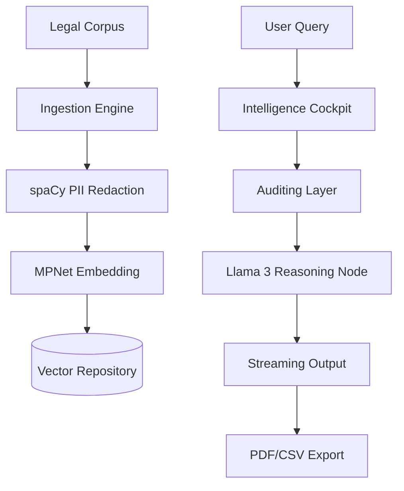

# LexVed: Advanced Private Legal Intelligence 

A full-stack, institutional-grade legal RAG (Retrieval-Augmented Generation) platform. Built with **Next.js**, **FastAPI**, and a dual-repository vector strategy (**Qdrant / Pinecone**).

## Overview
LexVed delivers zero-leak legal research via local **Llama 3 8B** inference. Every fact, citation, and legal reasoning is generated dynamically on-premise. The v2.5 update introduces the **Intelligence Cockpit**—a professional dashboard featuring functional Research History, Case Files management, and a Mission-Critical Performance Audit suite.

## Tech Stack
| Layer | Technology | Purpose |
| :--- | :--- | :--- |
| **Frontend** | Next.js 16 (Turbopack) | Premium Institutional Dashboard |
| **Backend** | FastAPI (Python 3.10) | Intelligence Gateway |
| **Vector DB** | Qdrant / Pinecone | Dual-Branch Vector Repository |
| **Inference** | Llama 3 8B (Local) | Private Reasoning Node |
| **Audit** | M1-M24 Framework | Automated Performance Benchmarking |

## Architecture

## Modular Intelligence Cockpit
*   **Performance Audit (M1-M24):** Real-time benchmarking of retrieval, quality, and legal accuracy.
*   **Research History:** Verified log of institutional legal queries.
*   **Case Files:** Direct management of the legal document repository.
*   **Institutional Export:** Date-stamped PDF and CSV audit reports.

## Branch Strategy
LexVed uses a tiered branch structure for enterprise adaptation:
*   **main:** The production baseline (current focus).
*   **qdrant:** Optimized for local, self-hosted Qdrant deployments.
*   **pinecone:** Targeted for cloud-hybrid vector storage via PineconeDB.

## API Reference
| Endpoint | Method | Description |
| :--- | :--- | :--- |
| `/api/chat` | `POST` | Streaming Legal Reasoning |
| `/api/metrics` | `GET` | M1-M24 Performance Report |
| `/api/files` | `GET` | Legal Corpus File Registry |
| `/api/history` | `GET` | Institutional Query Audit Log |

## Setup
1. **Infrastructure:** `ollama pull llama3` & `docker run qdrant/qdrant`.
2. **Backend:** `cd backend && pip install -r requirements.txt && python app.py`.
3. **Frontend:** `cd frontend && npm install && npm run dev`.

---
**LexVed | Institutional Legal Intelligence**
**Readme v2.5 — April 2026**
