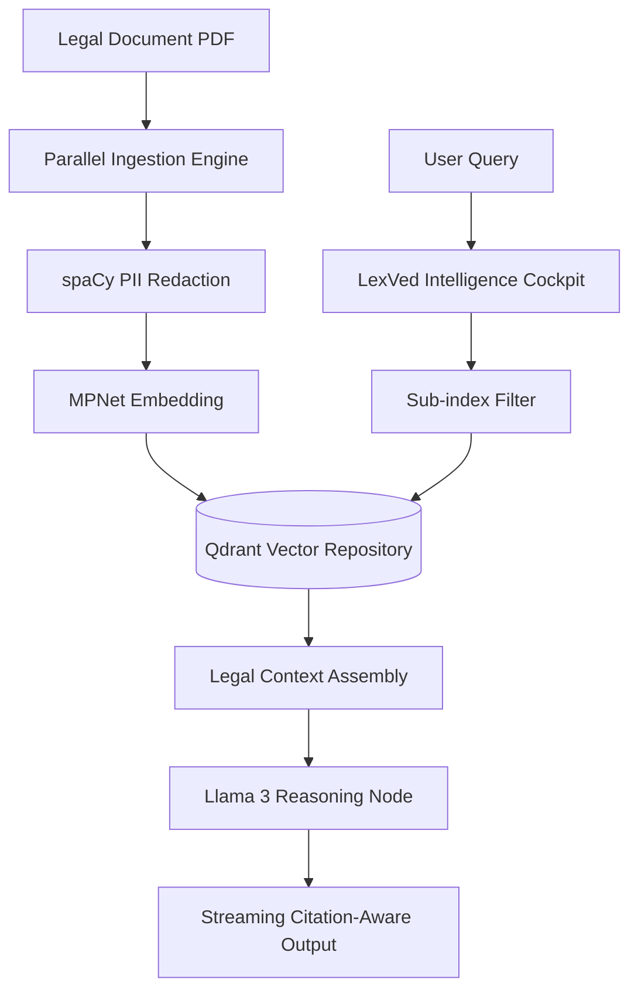

# LexVed: Advanced Private Legal Intelligence

A full-stack, institutional-grade legal RAG (Retrieval-Augmented Generation) platform that delivers high-precision legal research with 100% data privacy. Built with **Next.js**, **FastAPI**, **Qdrant**, and a local **Llama 3 8B** inference engine.

## Overview
Standard legal research engines often risk data privacy by sending sensitive case details to cloud APIs. **LexVed** takes a different approach: every recommendation, citation, and legal reasoning is generated dynamically and locally. Using **Hierarchical Sub-indexing**, LexVed partitions massive legal libraries (Civil, Criminal) into distinct domains to ensure noise-free, authoritative results.

The architecture is built for mission-critical reliability, allowing legal professionals to ingest, audit, and research documents without a single packet of sensitive data leaving the local local area network.

## Tech Stack
| Layer | Technology | Purpose |
| :--- | :--- | :--- |
| **Frontend** | Next.js 14 (React) | Premium Glassmorphic Dashboard |
| **Styling** | Vanilla CSS + Tailwind | Institutional "Noble Gold" Palette |
| **Backend** | FastAPI (Python 3.10) | High-Performance Async Intelligence Core |
| **Vector DB** | Qdrant (Self-hosted) | Hierarchical Point Storage & Retrieval |
| **Inference** | Llama 3 8B (via Ollama) | Private Legal Reasoning Engine |
| **Embeddings** | all-mpnet-base-v2 | High-Fidelity Semantic Mapping |
| **NLP/NER** | spaCy (en_core_web_sm) | Mandatory PII Redaction & Metadata Extraction |

## Architecture


## Features
### Core
*   **Hierarchical Sub-indexing:** Automatic partitioning of Civil vs. Criminal domains to prevent cross-domain hallucination.
*   **Parallel Scaling:** Multi-core ingestion capability designed for high-volume legal libraries.
*   **Streaming "Typewriter" Interface:** Real-time reasoning delivery for instantaneous user feedback.
*   **Citation Persistence:** Every legal fact is automatically mapped back to source filenames and page numbers.

### Intelligence & Security
*   **Local Inference Node:** 100% offline generation via Llama 3. No OpenAI/Cloud dependency.
*   **Automated PII Redaction:** Deep-scrubbing of Names, Aadhaar, PAN, and Emails before inference.
*   **Metrics Evaluation (M1-M24):** Built-in benchmarking for ROUGE, BLEU, BERTScore, and Legal-Specific accuracy.

## Project Structure
```text
LexVed/
├── frontend/          Next.js 14 Web Interface (App Router, Components)
├── backend/           FastAPI Core & Legal Logic
│   ├── src/           Modules: Ingestion, Retrieval, Generation, Evaluation
│   ├── data/          PDF Repository (Civil/Criminal directories)
│   ├── venv/          Isolated Python Dependency Environment
├── DPR.md             Detailed Project & Engineering Report
└── README.md          Project Overview & Handover
```

## Getting Started
### Prerequisites
*   Docker (for Qdrant)
*   Python 3.10+
*   Node.js 18+
*   Ollama (Pull `llama3`)

### 1. Initialize Infrastructure
```bash
# Start Vector Repository
docker run -p 6333:6333 qdrant/qdrant

# Pull LLM Node
ollama pull llama3
```

### 2. Set Up Environment
```bash
# Backend
cd backend
python -m venv venv
source venv/bin/activate
pip install -r requirements.txt

# Frontend
cd ../frontend
npm install
```

### 3. Ingest & Audit
```bash
# Run Parallel Ingestion
cd backend && ./venv/bin/python3 test_embedding_qdrant.py

# Run RAG Benchmark (M1-M24 Metrics)
./venv/bin/python3 run_metrics.py
```

### 4. Launch Cockpit
```bash
# Backend
./venv/bin/python3 app.py --port 5000

# Frontend
cd frontend && npm run dev
```

## API Reference
| Endpoint | Method | Description |
| :--- | :--- | :--- |
| `/api/chat` | `POST` | Primary Streaming Chat & Reasoning |
| `/api/diagnostic` | `GET` | Institutional System Health Audit |
| `/api/status` | `GET` | Ollama & Qdrant Readiness Check |

## Security
*   **Stateless Authentication:** All routes prepared for JWT integration.
*   **Data Isolation:** Qdrant collections are strictly partitioned by jurisdiction.
*   **Hardened Redaction:** spaCy NER ensures zero PII data reaches the inference logs.

## Roadmap
*   **Near-term:** Multi-jurisdictional sub-indexing (State vs. Federal).
*   **Mid-term:** Voice-enabled legal assistant (Speech-to-Text).
*   **Long-term:** Cross-reference graphs for inter-case citations.

---
**LexVed | Institutional Legal Intelligence**
