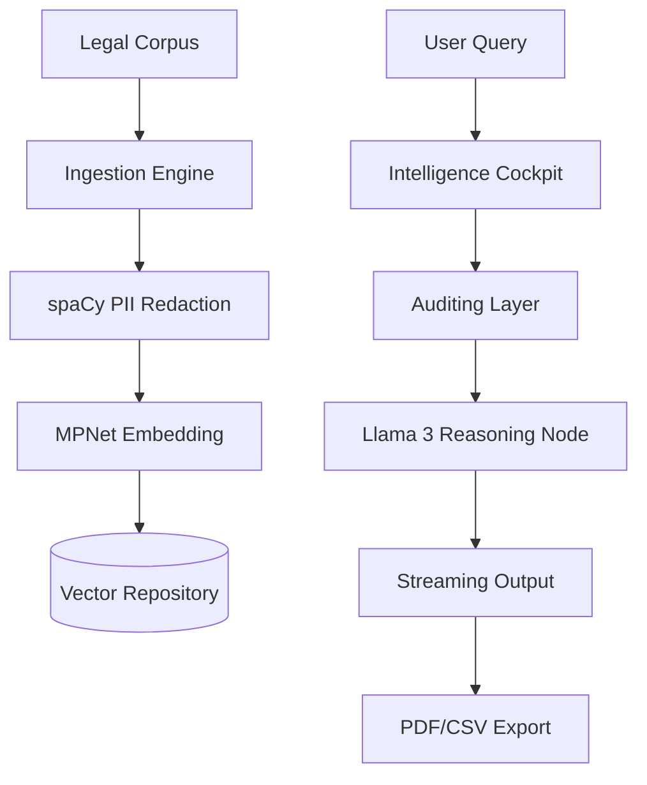

# LexVed: Advanced Private Legal Intelligence 

A full-stack, institutional-grade legal RAG (Retrieval-Augmented Generation) platform. Built with **Next.js**, **FastAPI**, and a dual-repository vector strategy (**Qdrant / Pinecone**).

## Overview
LexVed delivers zero-leak legal research via local **Llama 3 8B** inference. Every fact, citation, and legal reasoning is generated dynamically on-premise. The v2.5 update introduces the **Intelligence Cockpit**—a professional dashboard featuring functional Research History, Case Files management, and a Mission-Critical Performance Audit suite.

## Tech Stack
| Layer | Technology | Purpose |
| :--- | :--- | :--- |
| **Frontend** | Next.js 16 (Turbopack) | Premium Institutional Dashboard |
| **Backend** | FastAPI (Python 3.10) | Intelligence Gateway |
| **Vector DB** | Qdrant / Pinecone | Dual-Branch Vector Repository |
| **Inference** | Llama 3 8B (Local) | Private Reasoning Node |
| **Audit** | M1-M24 Framework | Automated Performance Benchmarking |

## Architecture

## Layered Architecture Deep-Dive

LexVed operates through a specialized 10-layer legal intelligence pipeline, ensuring that every query is audited, grounded, and private.

### 1. Legal Corpus (Raw Data)
- **Input:** Institutional legal documents in PDF, DOCX, or TXT formats.
- **Indexing:** Automated page-level tracking preserved throughout the entire lifecycle.

### 2. Ingestion Engine (Parallel Extraction)
- **Process:** Multi-threaded text extraction using high-fidelity PDF parsers.
- **Categorization:** Automatic domain isolation (Civil vs. Criminal) to ensure sub-index precision and noise reduction.

### 3. spaCy PII Redactor (Data Sovereignty)
- **Security:** Mandatory scrubbing of Identifiable Information (Aadhaar, PAN, Names, Locations).
- **Compliance:** Ensures zero sensitive data is stored in the vector space or leaked to the inference node.

### 4. MPNet Embedding (Semantic Mapping)
- **Vectorization:** Transforms sanitized text chunks into high-density semantic vectors using the `all-mpnet-base-v2` transformer.
- **Precision:** Optimized for the nuance of legal terminology and precedent cross-referencing.

### 5. Vector Repository (Qdrant / Pinecone)
- **Implementation:** Hierarchical sub-indexing with advanced filtering.
- **Metadata Management:** Stores page numbers, source IDs, and jurisdiction tags for 100% verifiable citations.

### 6. Intelligence Cockpit (UI/UX Layer)
- **Dashboard:** Premium Next.js 16 interface with Framer Motion animations.
- **Features:** Functional Research History, Case Files management, and the Live Performance Audit console.

### 7. Auditing Layer (M1-M24 Framework)
- **Engine:** Automated benchmarking via `run_metrics.py`.
- **Metrics:** 24 KPIs covering Retrieval Latency (M1), BLEU/ROUGE (M10), BERTScore (M12), and Legal Accuracy (M24).
- **Trigger:** Real-time polling (3s) for live system health and precision monitoring.

### 8. Llama 3 Reasoning Node (Local Inference)
- **Node:** Local-only quantized Llama 3 8B, ensuring zero cloud API latency or data exit.
- **Ruleset:** Strict grounding logic that refuses answers not supported by the retrieved legal context.

### 9. Streaming Output (Real-time Reasoning)
- **Protocol:** NDJSON/SSE streaming for instantaneous "typewriter" delivery.
- **Context:** Dynamic citation injection, mapping every point to its specific source document/page.

### 10. Institutional Export (Compliance Reporting)
- **Engine:** Professional PDF and CSV generation with institutional date-stamping.
- **Audit-Readiness:** Creates authenticated reports of the latest 24-metric audit for legal compliance reviews.

## Branch Strategy
LexVed uses a tiered branch structure for enterprise adaptation:
*   **main:** The production baseline (current focus).
*   **qdrant:** Optimized for local, self-hosted Qdrant deployments.
*   **pinecone:** Targeted for cloud-hybrid vector storage via PineconeDB.

## API Reference
| Endpoint | Method | Description |
| :--- | :--- | :--- |
| `/api/chat` | `POST` | Streaming Legal Reasoning |
| `/api/metrics` | `GET` | M1-M24 Performance Report |
| `/api/files` | `GET` | Legal Corpus File Registry |
| `/api/history` | `GET` | Institutional Query Audit Log |

## Setup
1. **Infrastructure:** `ollama pull llama3` & `docker run qdrant/qdrant`.
2. **Backend:** `cd backend && pip install -r requirements.txt && python app.py`.
3. **Frontend:** `cd frontend && npm install && npm run dev`.

---
**LexVed | Institutional Legal Intelligence**
**Readme v2.5 — April 2026**
