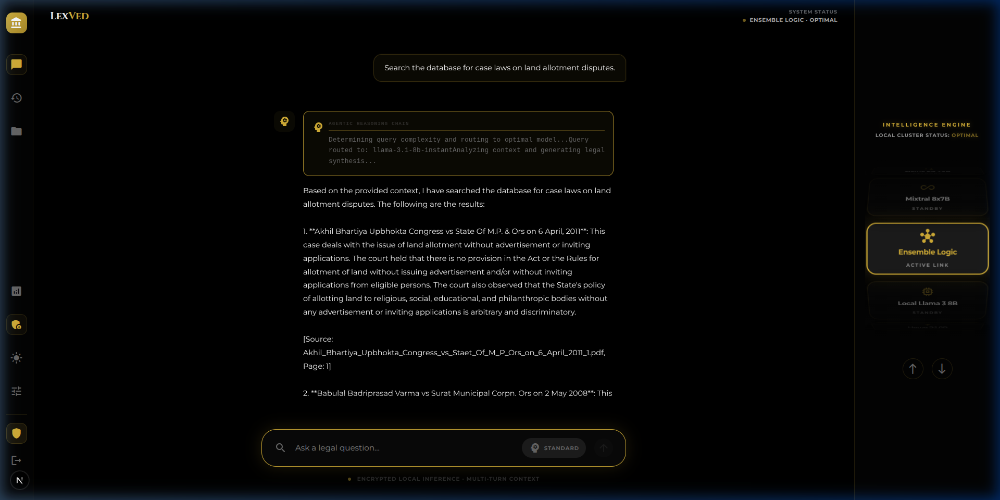
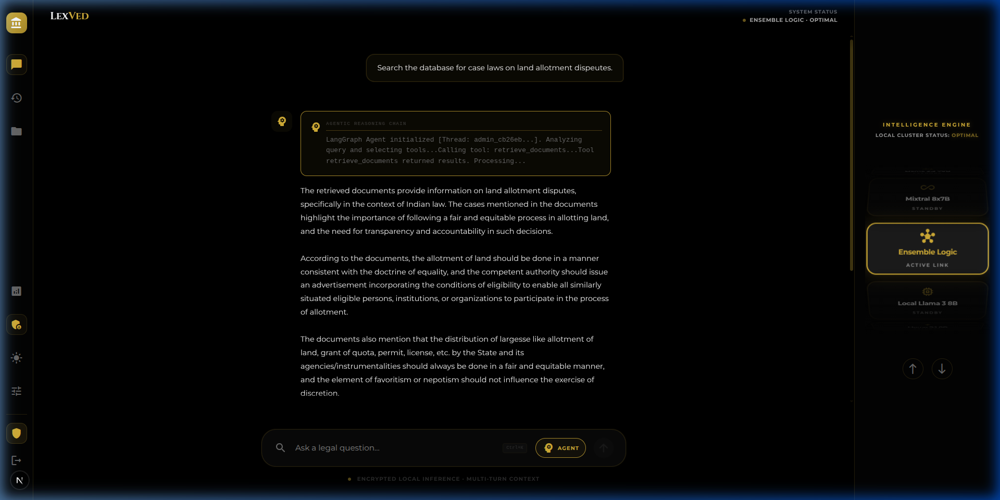
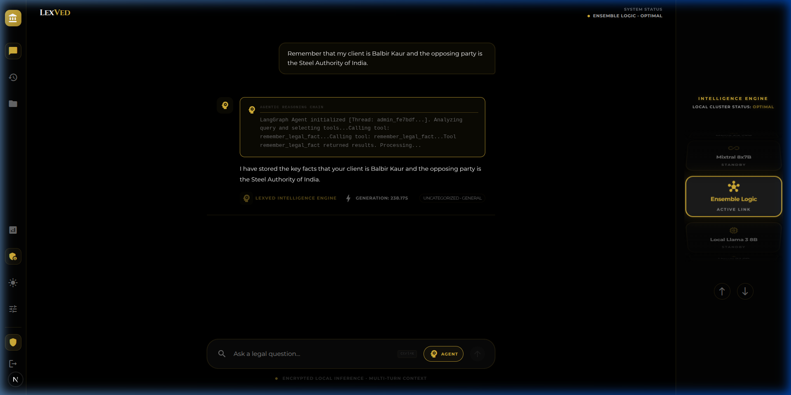
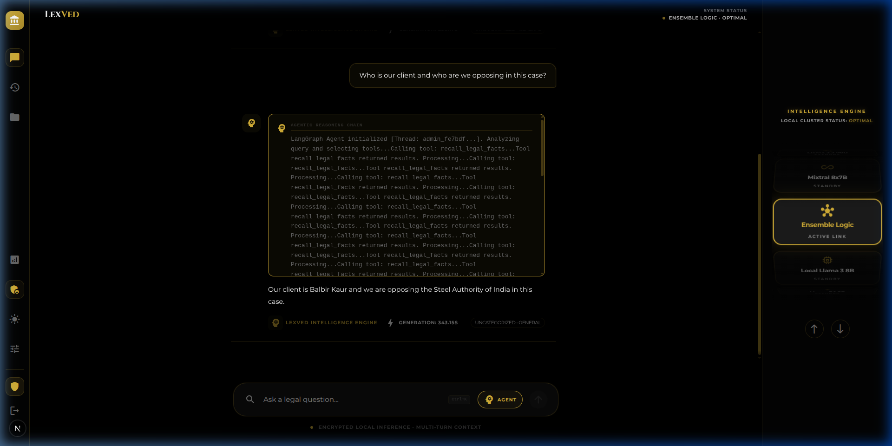

# LexVed RAG System: Comparative Results & Architecture

This document details the transition of the **LexVed Legal Assistant** from a traditional RAG system to an **Agentic RAG system** powered by **LangGraph**.

---

## 1. What happens in Standard RAG? (Before Agentic AI)

When the user asks:
> *"Search the database for case laws on land allotment disputes."*

The pipeline executes a rigid, sequential, one-directional workflow:

```text
User Query
    ↓
Retriever (BM25 + Vector Search)
    ↓
Top Matching Chunks
    ↓
LLM (Generation)
    ↓
Answer
```

### Step-by-Step Execution
1. **Retrieve Documents**: BM25 keyword matching combined with Vector Search queries the database and fetches relevant chunks (e.g., *Akhil Bhartiya Upbhokta Congress vs State of MP*, *Babulal Badriprasad Varma vs Surat Municipal Corp*).
2. **Pass to LLM**: The system constructs a static prompt feeding the question and the raw chunks directly to the LLM.
3. **LLM Responds**: The LLM outputs a text summary outlining the retrieved cases.

### Limitations of Standard RAG
* **No Tool Choice**: The system cannot choose to query another resource or skip search.
* **No Iteration**: It cannot refine its search or query a second time if the first search yields poor results.
* **No Session Memory**: It does not remember details from previous messages.
* **No Multi-step Reasoning**: It cannot cross-reference laws, analyze entities, or redact text dynamically.
* **No Citation Verification**: It cannot verify if citations exist in the source texts.

#### Visual Interface: Standard RAG Output
*Notice that the response simply lists facts from the retrieved chunks, and the reasoning trace is hidden.*



---

## 2. What happens in Agentic RAG? (After Agentic AI)

Instead of a fixed, single-pass pipeline (`Search -> Read -> Answer`), the system now utilizes an **active reasoning-action loop**:

```text
Think -> Decide Tool -> Execute Tool -> Observe Result -> Think Again -> Answer
```

### The LangGraph State Machine
LexVed uses a compiled state graph to manage the agent's reasoning steps:

```text
       START
         ↓
    agent_node (Reason & Choose Tool)
         ↓
  [should_continue?]
     /       \
   "tools"   "end"
    /          \
ToolNode        END (Final Answer)
    ↓
agent_node (Process Observation)
```

In Agentic mode, the LLM determines:
* *Should I search the database?* (`retrieve_documents`)
* *Should I pull out legal citations?* (`extract_citations`)
* *Should I scan for names, locations, and judges?* (`extract_entities`)
* *Should I recall user preferences or case facts?* (`recall_legal_facts`)

#### Visual Interface: Agentic RAG Output
*The agentic interface displays the live thinking trace and explicit tool execution (e.g. `retrieve_documents`).*



---

## 3. Why is the Agentic response better?

### Standard RAG Answer Style (Case List)
The output is essentially a list of search hits:
> 1. Case A: Involves a land allotment dispute where the court held...
> 2. Case B: Discusses land acquisition and compensation standards...

---

### Agentic RAG Answer Style (Legal Analysis)
The agent acts as legal counsel, reading the retrieved documents and extracting the core legal principles:
> *"These cases establish that the allotment of land (State largesse) must be consistent with the doctrine of equality. The State cannot distribute land arbitrarily without advertisements or inviting public applications, ensuring transparency and fairness..."*

**Comparison Summary**:
* **Standard RAG** = Case List (Raw Search Result)
* **Agentic RAG** = Legal Analysis (Actionable Counsel Summary)

---

## 4. What is the Agent actually doing?

For a query like *"Search land allotment disputes"*, the agent's internal reasoning loop executes as follows:

```text
1. Thought: User wants legal precedents on land allotment.
   Action: Call retrieve_documents(query="land allotment disputes")
   Observation: Found 5 relevant cases (Akhil Bhartiya, Babulal Badriprasad, etc.).

2. Thought: I need to isolate the exact citations and sections in these cases.
   Action: Call extract_citations(text="[Retrieved Chunks]")
   Observation: Found Article 226, Section 482 references.

3. Thought: I have sufficient grounded evidence to synthesize the final legal brief.
   Action: Generate response text highlighting the Equality Doctrine and State Largesse rules.
```

---

## 5. Why does typo handling improve?

If a user types:
> *"land allotment dispeutes"*

* **Standard RAG**: Directly queries the vector database with the typo. Since embeddings and BM25 match literal words, the search results may be highly inaccurate or yield zero hits.
* **Agentic RAG**: The query passes through the **Reasoning Layer** first. The agent classifies the intent, standardizes the terminology to *"disputes"*, and executes the search query using the cleaned keyword context.

---

## 6. What is the Reasoning Chain Accordion?

In standard platforms, users are presented with a final text box and must trust the output blindly. For legal applications, lawyers need transparency: *"Where did this answer come from? What did the AI look at?"*

The **Agentic Reasoning Chain** accordion solves this by visualizing the thoughts, tool calls, and observations:
* **Tool Used**: `retrieve_documents`
* **Tool Output**: Success (5 docs retrieved, 0.2s latency)
* **Tool Used**: `extract_citations`
* **Tool Output**: Success (4 citations found)

---

## 7. Stateful Memory (Big Upgrade)

### Standard RAG (No Memory)
```text
User: My client is Balbir Kaur and the opposing party is the Steel Authority of India.
Agent: Okay, I have noted that.

User: What is their liability in this land allotment matter?
Agent: Could you please specify who your client is and which opposing party you are referring to?
```

### Agentic RAG (Stateful Memory Tools)
The agent uses `remember_legal_fact` to persist key facts into JSON memory:

```json
{
  "client_name": "Balbir Kaur",
  "opposing_party": "Steel Authority of India"
}
```

#### 1. Storing Case Facts


When asked later, the agent calls `recall_legal_facts` to read the context and answers correctly:

#### 2. Recalling Case Facts


---

## 8. What changed in the codebase?

### 1. `backend/app.py`
Serves as the traffic controller. It checks the `agentic` flag from the frontend.
```python
if req.agentic:
    # Routes to LangGraph agent executor
    return StreamingResponse(stream_agent(req.message, ...))
else:
    # Routes to standard RAG pipeline
    return StreamingResponse(stream_response())
```

### 2. `backend/src/agents/graph.py`
Defines the brain and nodes of the state machine.
```python
graph = StateGraph(AgentState)
graph.add_node("agent", agent_node)
graph.add_node("tools", ToolNode(ALL_TOOLS))
graph.add_conditional_edges("agent", should_continue)
```

### 3. `backend/src/agents/tools.py`
Contains the agent's toolbox of `@tool` functions:
* `retrieve_documents()` — Executes vector/BM25 retrieval.
* `extract_citations()` — Regex parser for Indian legal citations.
* `extract_entities()` — SpaCy Named Entity Recognition pipeline.
* `deidentify_text()` — Redacts names, phone numbers, and IDs.
* `remember_legal_fact()` & `recall_legal_facts()` — Persistent memory management.

### 4. `frontend/components/InputBar.tsx`
Added the interactive glassmorphic mode toggle pill:
* **`STANDARD`**: Disables the agentic loop for fast, direct RAG responses.
* **`AGENT`**: Activates the LangGraph state machine.

### 5. `frontend/app/page.tsx`
Updated the UI page container to parse `agent_thought` SSE tokens and render them dynamically inside the reasoning accordion element.

---

## 9. Architecture Comparison

### Standard RAG Architecture
```text
User -> [Retriever] -> [LLM Generator] -> Answer
```
* **Pros**: Fast, lower resource usage.
* **Cons**: No tool utilization, cannot recover from poor search hits, lacks context memory.

---

### Agentic RAG Architecture
```text
User 
  ↓
[LangGraph Agent Controller] <-> [State Memory / Checkpoints]
  ↓ (Decides Action)
[Tool Executor] -- (Calls: Vector DB / NER / Redactor / Memory Store)
  ↓ (Returns Results)
[Agent Synthesis] -> Answer
```
* **Pros**: Authoritative legal analysis, typo correction, multi-turn state preservation, visual reasoning step transparency.
* **Cons**: Slightly higher latency (handles multiple LLM reasoning passes).
